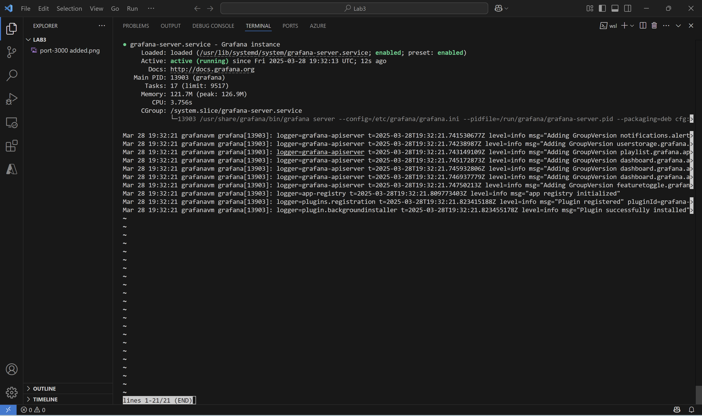
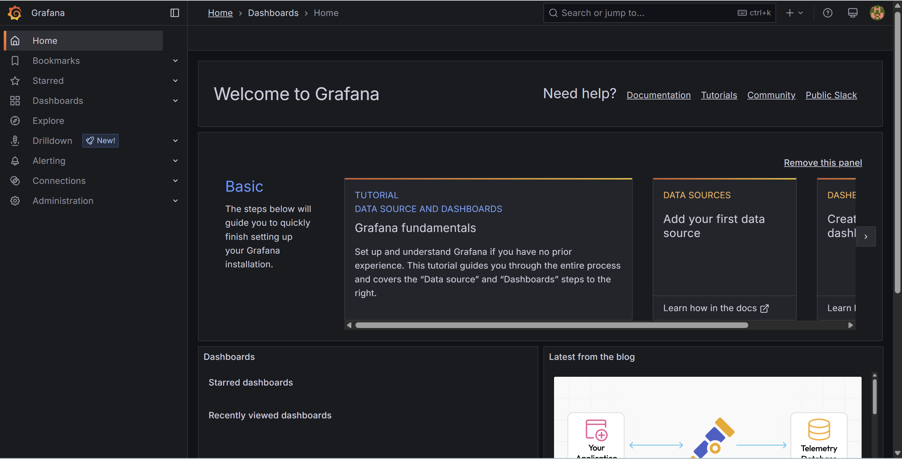
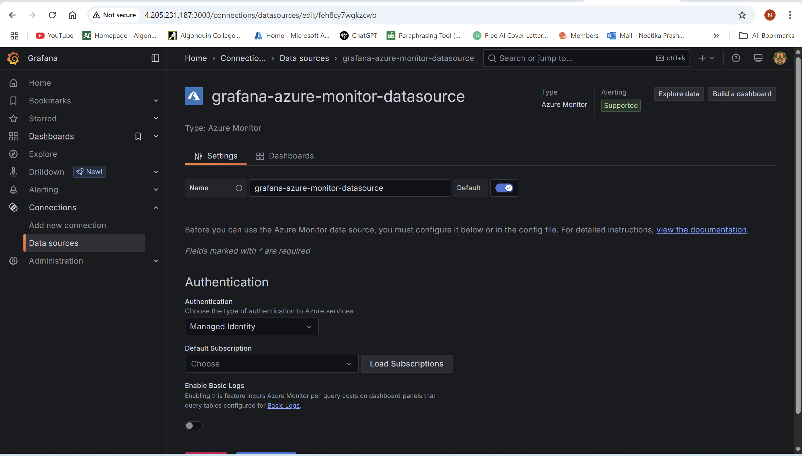
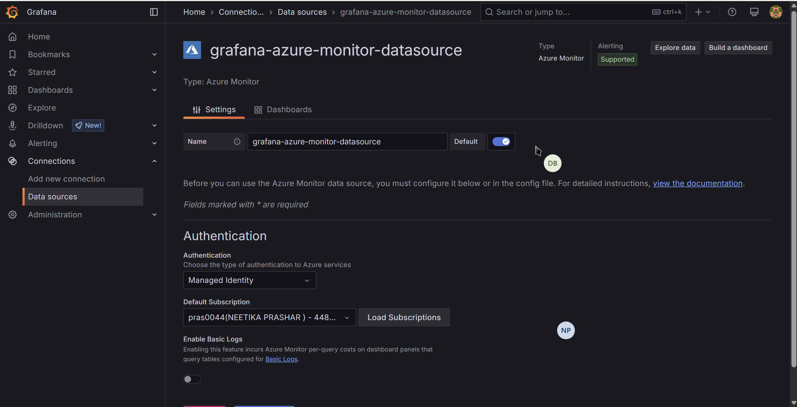
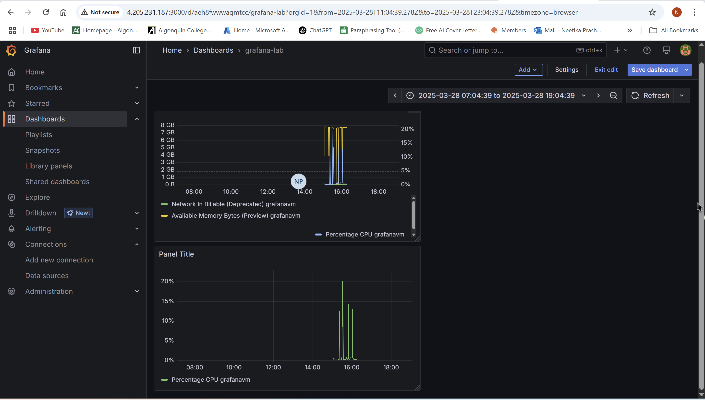

# Lab Assignment: Grafana Installation and Dashboard Creation for Ubuntu Server Performance

## Objective:
This lab guides you through the installation of Grafana on an Ubuntu machine, setting up the Azure Monitor agent for performance metrics collection, and creating a dashboard in Grafana to visualize the collected metrics.

## Prerequisites:
- An Ubuntu server (version 18.04 or later)
- An Azure account with permissions to create and manage Azure resources
- Basic understanding of the Linux command-line interface

## Lab Steps:

1. **Prepare the Ubuntu Server**  
   - Update and upgrade the server using the command:  
     ```bash
     sudo apt-get update && sudo apt-get upgrade
     ```

2. **Install Grafana**  
   - Add Grafana’s official APT repository and install Grafana:  
     ```bash
     sudo apt-get install -y apt-transport-https software-properties-common wget
     sudo mkdir -p /etc/apt/keyrings/
     wget -q -O - https://apt.grafana.com/gpg.key | gpg --dearmor | sudo tee /etc/apt/keyrings/grafana.gpg > /dev/null
     echo "deb [signed-by=/etc/apt/keyrings/grafana.gpg] https://apt.grafana.com stable main" | sudo tee -a /etc/apt/sources.list.d/grafana.list
     sudo apt-get update
     sudo apt-get install grafana
     ```
   - Start and enable Grafana:  
     ```bash
     sudo systemctl daemon-reload  
     sudo systemctl start grafana-server  
     sudo systemctl enable grafana-server
     ```
   - Verify Grafana is running:  
     ```bash
     sudo systemctl status grafana-server
     ```
     

   - Enable Port 3000 to access Grafana:  

     

     

     Ensure that you can access the server's Grafana interface.

3. **Connect Grafana to Azure Monitor**  
   - Enable Managed Identity for your Grafana VM.
   - Assign the VM’s managed identity the "Monitoring Reader" and "Reader" roles in Azure.
   - Edit `/etc/grafana/grafana.ini` for managed identity authentication.
   - Restart Grafana:  
     ```bash
     sudo systemctl stop grafana-server  
     sudo systemctl start grafana-server
     ```
   - Open Grafana in a web browser (usually `http://<your-server-ip>:3000`) and log in with the default credentials (`admin/admin`).
     

   - Navigate to `Configuration > Data Sources` and add "Azure Monitor".
   - Authenticate using Managed Identity and test the connection.
   
   - Add the subscription and test it.
   

4. **Create a dashboard in Grafana**
   - Click on the “+” icon on the left sidebar and select “Dashboard.”
   - Click on “Add new panel.”
   - From the data source dropdown, select “Azure Monitor.”
   - Choose the relevant metrics that you would like to visualize, such as CPU usage, memory usage, network I/O, etc.
   - Customize the panel with thresholds, colors, and labels.
   - Save the panel and the dashboard.

   

# Conclusion

Through the installation and configuration of Grafana on an Ubuntu server, this lab effectively illustrated how to enable real-time performance monitoring via Azure Monitor. Following the instructions, we combined Grafana with Azure Monitor to display important metrics like CPU, RAM, and network input/output in a dashboard that could be customized. The lab emphasized the significance of managed identities and system configuration for safe and smooth Azure data integration. In addition to increasing system visibility, the development of a dynamic, real-time dashboard gives administrators useful information for troubleshooting and performance optimization. A solid basis for efficient server monitoring and management in a production setting is established by this practical experience with Grafana and Azure Monitor.
